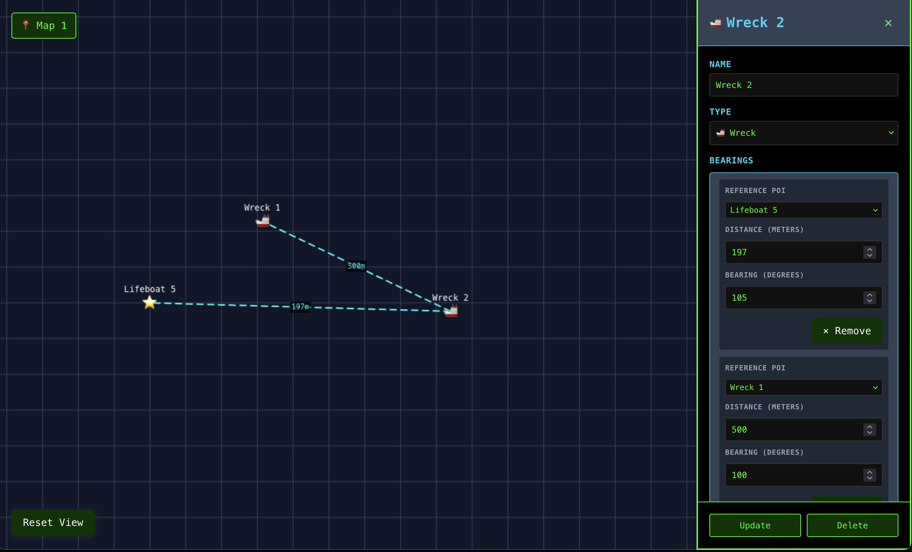

# Subnautica Map

Create subnautica maps based on triangulation and bearings.

Instead of having a fog-of-war map, this tool uses a coordinate-based system where players enter Points of Interest (POIs) based on bearings and distances from known locations, starting from Lifepod 5.

[View Here](https://24v.github.io/subnautica-map/)



### Installation

```bash
# Install dependencies
pnpm install

# Start development server
pnpm dev

# Run tests
pnpm test

# Build for production
pnpm build
```

### Development

```bash
# Run linting
pnpm lint

# Run tests with coverage
pnpm test:coverage

# Run tests with UI
pnpm test:ui
```

### Deployment

This is currently deployed through github pages: [View Here](https://24v.github.io/subnautica-map/)
